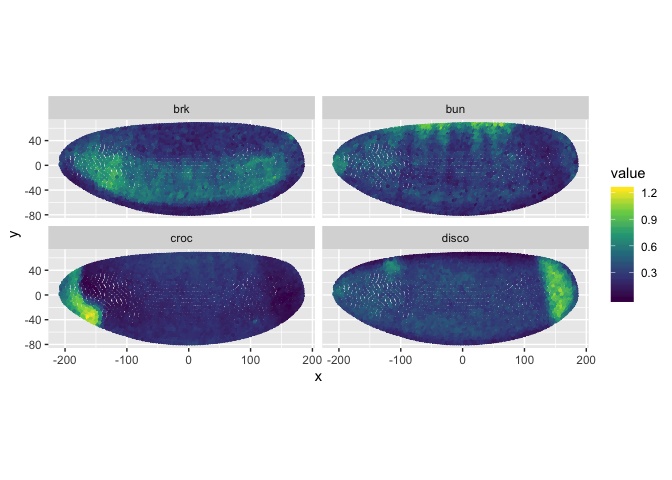
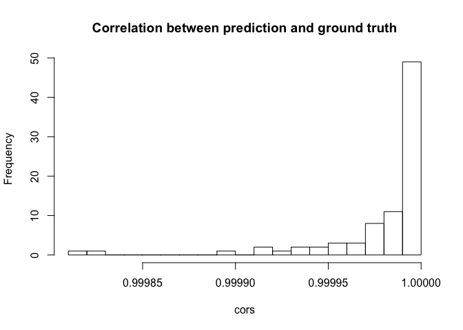

<!-- README.md is generated from README.Rmd. Please edit that file -->

## Introduction

While single cell RNA-seq (scRNA-seq) gives us insights on biological
systems with unprecedented resolution, as tissue dissociation is
required for scRNA-seq, spatial context of gene expression is lost.
`novoSpaRc` is a way to reconstruct the spatial context of gene
expression by optimal transport. `novoSpaRc` is described in the paper
[Charting a Tissue from Single Cell
Transcriptomes](https://www.biorxiv.org/content/10.1101/456350v1). The
paper authors implemented this method in Python, which can be found
[here](https://github.com/rajewsky-lab/novosparc). This package is an R
implementation of this method.

In short, what `novoSpaRc` does is to find a probabilistic assignment of
cells to locations that makes spatial relationships among locations
similar to gene expression similarities among cells in scRNA-seq, with
or without taking into account an in situ atlas that quantifies
expression of some landmark genes in spatial locations.

In this vignette, we spatially reconstruct gene expression in late stage
5 Drosophila embryo. On a 2017 MacBook Pro with R using Acceleration
Framework BLAS, this entire vignette takes about 3 minutes to run. This
package assumes that cells that are physically closer to each other also
tend to have more similar gene expression profiles. Please check if this
assumption holds prior to using this package.

## Installation

This package is not yet on CRAN or Bioconductor. Please install it with

``` r
devtools::install_github("lambdamoses/novoSpaRc")
```

We also strongly recommend an optimized BLAS, as this package makes
heavy use of matrix multiplications, and the matrices can be large for
larger datasets. The default BLAS that comes with R is not optimized; an
optimized BLAS can speed up matrix multiplications several times. To use
an optimized BLAS from R, you can install [Microsoft R
Open](https://mran.microsoft.com/open), which uses the optimized [Intel
Math Kernel Library (MKL)](https://software.intel.com/en-us/mkl) on
Windows and Linux and Acceleration Framework on MacOS for BLAS. Other
optimized BLAS are [OpenBLAS](https://www.openblas.net) and
[ATLAS](http://math-atlas.sourceforge.net).

For MacOS users, you may change the version of BLAS used by R without
reinstalling R by adding a symbolic link from `libRblas.dylib` to the
desired BLAS. For example, for R installed from CRAN binary, here is how
to make R use the BLAS from Acceleration Framework, which comes with
MacOS:

``` bash
cd /Library/Frameworks/R.framework/Resources/lib
ln -sf /System/Library/Frameworks/Accelerate.framework/Frameworks/vecLib.framework/libBLAS.dylib \
libRblas.dylib
```

For changing BLAS on Windows and Ubuntu, see [this blog
post](http://brettklamer.com/diversions/statistical/faster-blas-in-r/).
For Fedora, see [this
post](https://loveshack.fedorapeople.org/blas-subversion.html).

## Example

Here we predict where genes are expressed in the late stage 5 Drosophila
embryo. Only 4 landmark genes would suffice to give decent predictions.

``` r
library(novoSpaRc)
```

Here’s the data we use in this vignette. Object `bdtnp` is a numeric
matrix with 84 genes in columns and 3039 cells in rows. Object
`locations` is a data frame with 3 columns for x, y, and z coordinates
of cells in an archetypal late stage 5 Drosophila embryo. The gene count
data should be normalized before running `novoSpaRc`; the `bdtnp` data
here is already normalized.

``` r
# Load data
data("bdtnp", "locations")
```

First, we calculate graph-based distance matrices among cells and among
locations. The reason why graph-based distance is used is that Euclidean
distance may not capture structures in the non-linear manifold.

``` r
D_cell <- calc_graph_dist(bdtnp, k = 5, transposed = TRUE)
D_loc <- calc_graph_dist(locations, k = 5, transposed = TRUE)
```

    #> Warning in (function (jobs, data, centers, info, k, get.index,
    #> get.distance) : tied distances detected in nearest-neighbor calculation

In fact, we do have spatial information for expression of landmark genes
– the `locations` data frame has spatial locations of the corresponding
cells in `bdtnp`. Here we simply dissociate the locations from gene
expression to pretend that we have single cell data that does not have
spatial information.

In the case when we do have spatial information for some landmark genes,
but not the entire transcriptome, as is the case for most quantitative
and single cell resolution in situ methods such as MERFISH and STARmap,
the in situ data for the landmark genes can be used in `novoSpaRc` to
improve prediction. Here we introduce the in situ data to `novoSpaRc` by
computing distance from each cell to each location in the space of
expression of the landmark genes. Only a few genes can give decent
prediction for other genes. Here we’ll randomly choose 4 genes as
landmark.

``` r
set.seed(19)
genes_use <- sample(colnames(bdtnp), 4)
bdtnp_sub <- bdtnp[, genes_use]
D_cell_loc <- as.matrix(dist(bdtnp_sub))
```

These are the landmark genes to use:

``` r
genes_use
```

    #> [1] "Btk29A"  "ftz"     "Kr"      "Blimp-1"

Now we can probabilistically assign cells to locations. We need some
prior knowledge of marginal distributions of cells and locations in this
probabilistic assignment. When prior knowledge is absent, then the
uniform distribution will be used, as is the case here. Here we will get
a matrix whose entries sum to 1 that has the probability of each cell
being assigned to each location. Cells are in rows and locations are in
columns. The argument `alpha` is the weight given to the landmark genes
in in situ data.

This is the most time consuming step, where two matrix multiplications
are done in each iteration. The matrices can be large if the dataset has
many cells. This is why an optimized BLAS is recommended.

``` r
p <- rep(1, nrow(bdtnp_sub)) / nrow(bdtnp_sub)
q <- rep(1, nrow(locations)) / nrow(locations)
cell_loc <- gw_assign(D_cell, D_loc, D_cell_loc, alpha = 0.5, p = p, q = q, check_every = 1)
```

    #> Iteration 1, delta: 0.0181215
    #> Iteration 2, delta: 9.145969e-05
    #> Iteration 3, delta: 2.106041e-08
    #> Iteration 4, delta: 3.599985e-12

Now we can predict gene expression\!

``` r
gene_pred <- predict_expr_loc(bdtnp, cell_loc, transposed = TRUE)
```

Let’s plot the predictions of some genes that are not in the landmark
genes. The prediction is actually in 3D, and the
`plot_spatial_expression` function can make interactive 3D plots, but to
make the rendered html file smaller, we plot the 2 most informative
dimensions.

``` r
set.seed(29)
genes_plot <- sample(setdiff(colnames(bdtnp), genes_use), 4)
plot_spatial_expression(gene_pred[genes_plot,], locations[,c(1,3)], pt_size = 0.7)
```



Compare this to the ground
truth

``` r
plot_spatial_expression(bdtnp[,genes_plot], locations[,c(1,3)], transposed = TRUE, 
                        pt_size = 0.7)
```


See how well the prediction correlates with ground truth:

``` r
cors <- diag(cor(t(gene_pred), bdtnp))
hist(cors, breaks = 20, main = "Correlation between prediction and ground truth")
```



The correlation between prediction and ground truth is almost perfect
for all 84 genes. Note that here we artificially made scRNA-seq data by
ignoring spatial information. Normally, we may need to correct for batch
effect before calculating distance between each cell and each location
in the in situ data, and the correlation may not be this impressive.

``` r
sessionInfo()
```

    #> R version 3.5.2 (2018-12-20)
    #> Platform: x86_64-apple-darwin15.6.0 (64-bit)
    #> Running under: macOS Mojave 10.14.3
    #> 
    #> Matrix products: default
    #> BLAS: /System/Library/Frameworks/Accelerate.framework/Versions/A/Frameworks/vecLib.framework/Versions/A/libBLAS.dylib
    #> LAPACK: /Library/Frameworks/R.framework/Versions/3.5/Resources/lib/libRlapack.dylib
    #> 
    #> locale:
    #> [1] en_US.UTF-8/en_US.UTF-8/en_US.UTF-8/C/en_US.UTF-8/en_US.UTF-8
    #> 
    #> attached base packages:
    #> [1] stats     graphics  grDevices utils     datasets  methods   base     
    #> 
    #> other attached packages:
    #> [1] novoSpaRc_0.99.0
    #> 
    #> loaded via a namespace (and not attached):
    #>  [1] Rcpp_1.0.0          compiler_3.5.2      pillar_1.3.1       
    #>  [4] plyr_1.8.4          Barycenter_1.3.1    BiocNeighbors_1.0.0
    #>  [7] tools_3.5.2         digest_0.6.18       viridisLite_0.3.0  
    #> [10] jsonlite_1.6        evaluate_0.13       tibble_2.0.1       
    #> [13] gtable_0.2.0        pkgconfig_2.0.2     rlang_0.3.1        
    #> [16] graph_1.60.0        yaml_2.2.0          parallel_3.5.2     
    #> [19] xfun_0.5            httr_1.4.0          dplyr_0.8.0.1      
    #> [22] stringr_1.4.0       knitr_1.22          htmlwidgets_1.3    
    #> [25] S4Vectors_0.20.1    stats4_3.5.2        grid_3.5.2         
    #> [28] tidyselect_0.2.5    data.table_1.12.0   glue_1.3.0         
    #> [31] R6_2.4.0            plotly_4.8.0        RBGL_1.58.1        
    #> [34] BiocParallel_1.16.6 rmarkdown_1.11      tidyr_0.8.3        
    #> [37] purrr_0.3.1         ggplot2_3.1.0       magrittr_1.5       
    #> [40] scales_1.0.0        htmltools_0.3.6     BiocGenerics_0.28.0
    #> [43] assertthat_0.2.0    colorspace_1.4-0    labeling_0.3       
    #> [46] stringi_1.3.1       lazyeval_0.2.1      munsell_0.5.0      
    #> [49] crayon_1.3.4
